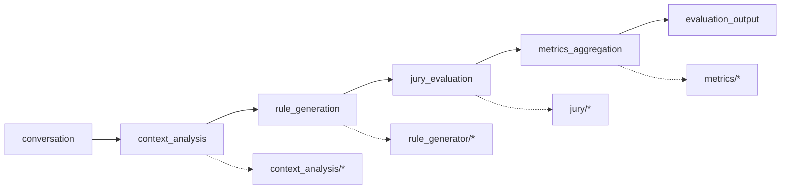

# adapteval-agent2 — Documentação dos Módulos

Este projeto avalia respostas de um assistente em conversas multi-turn usando
um pipeline de 4 estágios ("Análise de Contexto -> Gerador de Regras -> LLM
as a Jury -> Agregação das métricas"), implementado como um grafo LangGraph
com checkpointing por nó.

## Índice

| Arquivo | Conteúdo |
|---|---|
| [agent.md](agent.md) | Orquestração do pipeline: grafo LangGraph, nós, estado, schema de saída, front-end conversacional (`deepagents`) |
| [context_analysis.md](context_analysis.md) | Estágio 1 — análise estrutural, semântica, de complexidade e de intenção da conversa |
| [rule_generator.md](rule_generator.md) | Estágio 2 — classificação de tarefa, definição de objetivos, geração de critérios (rubrica) e checks heurísticos |
| [jury.md](jury.md) | Estágio 3 — painel de juízes (LLM + Typesafe), votação majoritária por critério booleano, human-in-the-loop |
| [metrics.md](metrics.md) | Estágio 4 — consolidação da nota final ponderada; módulos de composição/threshold ainda não usados pelo pipeline atual |
| [memory_manager.md](memory_manager.md) | Cache, histórico, detecção de erros, calibração e persistência em PostgreSQL |
| [shared.md](shared.md) | Infraestrutura compartilhada: cliente LLM, gestão de prompts (Langfuse), cliente Typesafe, utilitários, logging |
| [config.md](config.md) | Todas as variáveis de ambiente/configuração (`src/config.py`) |
| [legacy_main.md](legacy_main.md) | `src/main.py` — implementação antiga/paralela do agente, não é o caminho usado em produção |

## Visão geral do pipeline

Cada nó do grafo (definido em `src/agent/nodes.py`, montado em
`src/agent/pipeline_graph.py`) escreve numa chave própria do estado
(`src/agent/state.py`); o LangGraph mescla essas chaves e o checkpointer
salva um snapshot do estado após cada nó.

## Pontos de entrada

- **`scripts/run_deep_agent.py`** — roda o pipeline (`run_pipeline`, chamada
  direta ao grafo) sobre um dataset inteiro (lista de conversas exportadas do
  Langfuse), escrevendo o resultado estruturado incrementalmente em JSON. É o
  caminho recomendado para avaliação em lote: schema garantido, sem passar
  pelo front-end conversacional.
- **`src.agent.evaluate_conversation`** — mesma coisa, mas via o agente
  conversacional (`deepagents`), que chama a ferramenta `run_thesis_pipeline`
  internamente. Útil para testar/demonstrar o front-end; para uso
  programático prefira `run_pipeline` diretamente.
- **`src/main.py`** (`AdaptiveJuryAgent`) — implementação legada e paralela,
  não orquestrada por LangGraph. Ver [legacy_main.md](legacy_main.md).

## Saída estruturada

Toda avaliação produz um `EvaluationOutput` (`src/agent/schema.py`) com três
partes:

- `avaliacao`: lista de `MetricaAvaliada { metrica, valor, confianca }` —
  inclui o veredito booleano (1.0/0.0) de cada juiz por critério
  (`LLM-<provider>.<criterio>`), o veredito majoritário do painel
  (`jury.<criterio>`), e os 4 componentes da nota final consolidada
  (`final.jury`, `final.heuristic`, `final.accuracy`, `final.context`, estes
  em escala 0-10).
- `nota_confianca_global`: confiança geral da avaliação (0-1).
- `relatorio_consolidacao_metricas`: nota final ponderada, recomendação
  textual, pontos fortes/fracos e o detalhamento por componente.

## Coisas não óbvias que valem a pena saber

- **Juízes votam booleano, não dão nota.** Cada critério da rubrica
  (gerada em `rule_generator/criteria.py`, sempre formulada como
  pergunta sim/não) é respondido True/False por cada juiz; o painel decide
  o veredito de cada critério por maioria dos juízes que responderam
  (empate fecha em False). Ver [jury.md](jury.md).
- **Prompts são gerenciados pelo Langfuse**, não só pelo texto em
  `src/shared/llm/prompts.py`: uma vez publicado lá, a versão do Langfuse
  tem prioridade sobre o default local. Editar o texto em `prompts.py` não
  tem efeito até rodar `scripts/push_prompts_to_langfuse.py`. Ver
  [shared.md](shared.md).
- **Módulos instanciados mas não usados pelo pipeline atual**:
  `CalibrationManager` (memory_manager) e `JuryComposition`/
  `ThresholdCalculator` (metrics) existem e são usados por `main.py`
  (legado), mas o `PipelineNodes`/LangGraph atual não os chama.
- **`shared/infra/`** (`VectorStore`, `InMemoryQueue`, `TaskProcessor`) são
  placeholders não conectados a nada no pipeline real.
