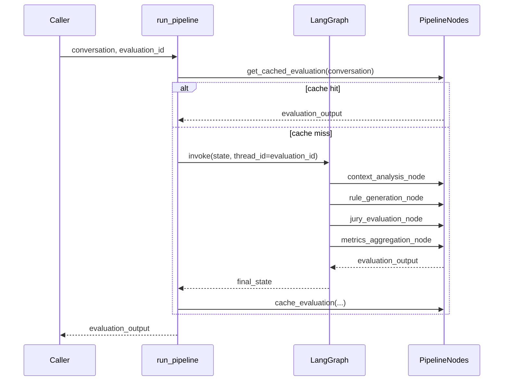

# `src/agent/` — Orquestração do Pipeline

Este é o módulo que amarra os outros quatro (`context_analysis`,
`rule_generator`, `jury`, `metrics`) num grafo LangGraph com estado
persistido, e expõe dois jeitos de rodá-lo: chamada direta (schema
garantido) ou via agente conversacional.

## Arquivos

### `state.py` — `PipelineState`

`TypedDict` (`total=False`) com uma chave por estágio:

```python
conversation, evaluation_id,          # input
response, query,                      # derivados no nó 1
context_analysis, rule_generation,    # saída dos nós 1 e 2
jury_evaluation, metrics_aggregation, # saída dos nós 3 e 4
evaluation_output                     # resultado final (nó 4)
```

Cada nó retorna só as chaves que ele possui; o LangGraph mescla no estado
compartilhado e o checkpointer tira um snapshot após cada nó.

### `pipeline_graph.py` — construção e execução do grafo

- `get_checkpointer()`: checkpointer processo-wide. Usa `PostgresSaver` se
  `USE_POSTGRES_MEMORY=true` (mesmo Postgres do `memory_manager`), com
  fallback silencioso para `InMemorySaver` se a conexão falhar.
- `get_pipeline_nodes()`: instância processo-wide de `PipelineNodes`
  (compartilhada entre grafo e `run_pipeline`, para que cache/histórico não
  dupliquem por chamada).
- `build_pipeline_graph()`: monta o `StateGraph` linear —
  `START -> context_analysis -> rule_generation -> jury_evaluation -> metrics_aggregation -> END`.
- `run_pipeline(conversation, evaluation_id=None, user_id=None, tags=None, metadata=None)`:
  ponto de entrada principal.
  1. Checa cache (`PipelineNodes.get_cached_evaluation`, chave = hash da
     conversa) — se houver hit, devolve sem rodar o grafo (⚠️ não gera novos
     checkpoints nesse caso).
  2. `evaluation_id` também é usado como `thread_id` do LangGraph e como
     `session_id` do Langfuse, então dá pra retomar/inspecionar a run depois
     por qualquer um dos dois.
  3. Invoca o grafo com tracing do Langfuse acoplado (se configurado).
  4. Salva o `evaluation_output` no cache antes de devolver.

### `nodes.py` — `PipelineNodes` e os 4 nós

Uma instância guarda todos os componentes de negócio (um de cada classe dos
outros módulos) para não recriá-los a cada chamada.

- **`context_analysis_node`**: extrai `response`/`query` da conversa
  (`_extract_response_and_query`, pega o último turno assistant e o user
  anterior) e roda `ContextAnalyzer.analyze`.
- **`rule_generation_node`**: classifica a tarefa, define objetivos, gera
  critérios (rubrica) e roda os checks heurísticos.
- **`jury_evaluation_node`**: monta `jury_context` — **importante**: o
  `context_analysis` não carrega `task_type` (isso vem de
  `rule_generation`) nem `complexity_score` no nível esperado pelos
  evaluators (`context["complexity"]["complexity_score"]`, aninhado). O nó
  precisa achatar isso explicitamente:
  ```python
  jury_context = {
      **context,
      "task_type": rules["task_type"],
      "complexity_score": context.get("complexity", {}).get("complexity_score"),
  }
  ```
  Sem isso, todo prompt/instrução de juiz sempre mostra "Task type: general"
  e "Complexity: unknown", não importa a conversa real (bug já corrigido,
  mas fácil de reintroduzir se esse nó for reescrito). Depois chama
  `EvaluatorPanel.evaluate` e, se a confiança do painel for baixa, aciona
  `HumanInTheLoop.request_review`.
- **`metrics_aggregation_node`**: calcula `accuracy` (contra dados anotados,
  se houver), chama `FinalScoreCalculator`, monta o relatório, registra no
  `HistoryTracker`, roda `ErrorDetector`, e finalmente chama
  `_build_evaluation_output` para montar o JSON final.

#### `_build_evaluation_output`

Função módulo-level (não é método) que monta o `EvaluationOutput`
(ver `schema.py`) a partir dos resultados dos 4 estágios:

- Para cada avaliação individual em `jury_result["evaluations"]`, gera uma
  métrica `"<evaluator>.<criterio>"` com `valor = 1.0/0.0` (booleano do
  veredito) e a confiança específica daquele critério
  (`criterion_confidences`, quando existir — só o `TypesafeEvaluator`
  preenche isso; para os LLMEvaluators cai no `confidence` geral do juiz).
- Para cada critério em `jury_result["verdicts"]` (o veredito majoritário do
  painel), gera uma métrica `"jury.<criterio>"`.
- Para cada componente em `final_score["component_breakdown"]`, gera uma
  métrica `"final.<componente>"` em escala 0-10 (`jury`, `heuristic`,
  `accuracy`, `context`).

### `schema.py` — contrato de saída (Pydantic)

```
MetricaAvaliada       { metrica: str, valor: float, confianca: float }
RelatorioConsolidacao { evaluation_id, final_score, confidence,
                        recommendation, summary, detailed_breakdown }
EvaluationOutput      { avaliacao: [MetricaAvaliada],
                        nota_confianca_global: float,
                        relatorio_consolidacao_metricas: RelatorioConsolidacao }
```

`valor` tem semântica dupla, documentada no próprio campo: 1.0/0.0 para
vereditos de rubrica (`jury.*`, `<evaluator>.*`) e escala 0-10 para as
métricas de consolidação final (`final.*`).

### `deep_agent.py` — front-end conversacional

Constrói um agente `deepagents` cuja **única ferramenta**
(`run_thesis_pipeline`) chama `pipeline_graph.run_pipeline` e devolve o JSON
bruto. O `SYSTEM_PROMPT` instrui o agente a chamar essa ferramenta exatamente
uma vez e a repassar o JSON sem comentários — o agente nunca calcula nada
sozinho.

- `create_evaluation_deep_agent()`: monta o agente (`ChatOpenAI` configurado
  com `LLM_MODEL`/`LLM_API_KEY`/etc. de `config.py` — **não** é o mesmo
  modelo dos juízes, é o modelo do próprio agente conversacional), com o
  mesmo checkpointer do grafo.
- `evaluate_conversation(conversation, thread_id=None, ...)`: invoca o
  agente e faz `json.loads` na resposta final (com fallback pra
  `{"raw_response": ...}` se não for JSON válido).
- **Para uso programático, prefira `run_pipeline` diretamente** — é o mesmo
  resultado, sem o custo/risco de passar por uma chamada de chat extra.

## Fluxo ponta a ponta


