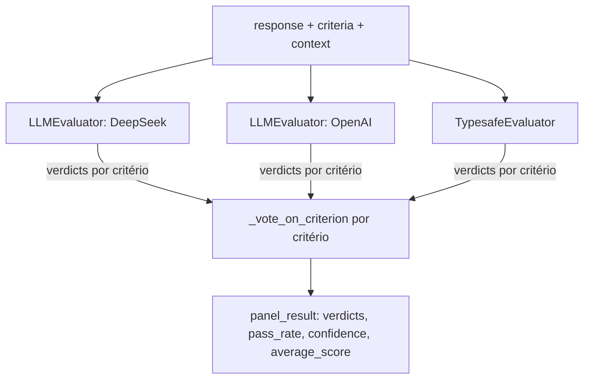

# `src/jury/` — Estágio 3: LLM as a Jury

Painel de juízes que avalia a resposta contra a rubrica gerada no estágio 2.
**Os juízes não dão nota (0-10): cada um responde True/False para cada
critério**, e o painel decide o veredito final de cada critério por
**votação majoritária** entre os juízes que responderam aquele critério.

## `evaluators.py`

### `Evaluator` (ABC)

Interface: `evaluate(response, criteria, context) -> Dict` e `get_name()`.

### `LLMEvaluator` — juiz genérico via chat completion

Usado para qualquer provider de `JURY_PROVIDERS` exceto `typesafe` (hoje:
DeepSeek e OpenAI). Um `LLMClient` próprio por instância, com
`max_tokens=JURY_LLM_MAX_TOKENS` (bem maior que o padrão do resto do
pipeline — ver seção "Pegadinha: tokens de raciocínio" abaixo).

- `_build_eval_prompt`: monta `criteria_text` (`"- Nome: descrição"` por
  critério) e chama o template Langfuse `llm_evaluation` (ver
  [shared.md](shared.md)) com `task_type`, `complexity_score`, `response` e
  `criteria_text`.
- O prompt pede uma linha `"<Nome do Critério>: True|False"` por critério,
  na ordem da rubrica, seguida de `Confidence: <0-1>` e `Reasoning: ...`.
- `_parse_evaluation(eval_text, criterion_names)`: para cada nome de
  critério esperado, procura uma linha que comece com
  `"<nome em minúsculo>:"` e extrai `True`/`False`. **Um critério que o
  modelo não respondeu nesse formato simplesmente não entra no dict
  `verdicts`** — o juiz "se abstém" daquele critério em vez de receber um
  valor forçado/adivinhado. `Confidence:` é parseada à parte (default 0.5
  se ausente ou não numérica).
- Retorna `{ verdicts: {criterio: bool}, confidence: float, reasoning: str,
  evaluator, evaluator_type }`.

### `TypesafeEvaluator` — juiz via API estruturada Typesafe

Não é uma chat completion: usa `TypesafeClient.ask(state, questions)`, uma
pergunta tipada por critério, tipo `"noul"` (yes/no).

- Uma pergunta por critério, chave `criterion_{i}`, com `instructions`
  contendo o mesmo padrão de rigor do prompt do `LLMEvaluator` ("responda
  True só se a resposta satisfaz completa e claramente o critério; sem
  crédito parcial") — isso é deliberado, para não deixar esse juiz com um
  padrão mais frouxo só por ter uma API diferente.
- **A API do Typesafe não devolve `true`/`false` literal**: o campo `noul`
  é sempre um float 0-1 (`{"type": "noul", "noul": 0.83}`). O código
  converte: `verdicts[nome] = noul >= 0.5`. Isso é visível cru no Langfuse
  (você vai ver `0.83`, não `"True"`) — é o formato nativo da API, não um
  bug.
- Como `noul` não vem com um campo de confiança separado, a confiança do
  veredito é derivada da distância até o limiar de decisão:
  `confidence = abs(noul - 0.5) * 2` (0.5 de resposta = confiança 0; 0.0 ou
  1.0 = confiança máxima). Guardado por critério em
  `criterion_confidences`.
- Retorna `{ verdicts, criterion_confidences, confidence (média das
  criterion_confidences), evaluator, evaluator_type }`.

### `RulesBasedEvaluator` — não usado pelo painel atual

Dá nota 0-10 por regras simples de string-matching (tamanho da resposta,
presença de palavras de erro, comprimento médio de sentença). **Não está
listado em `EvaluatorPanel._init_evaluators` nem em `JURY_PROVIDERS`** —
código morto/histórico, mantido no arquivo mas não instanciado por ninguém.

### `EvaluatorPanel` — orquestra o painel e vota

`__init__(providers=None)` instancia um `TypesafeEvaluator` para o provider
`"typesafe"` e um `LLMEvaluator` para cada outro provider de
`JURY_PROVIDERS` (default: DeepSeek, OpenAI, Typesafe — 3 juízes, batendo
com `MIN_EVALUATORS=3`).

`evaluate(response, criteria, context)`:

1. Chama `evaluator.evaluate(...)` em cada juiz, coleta a lista bruta em
   `evaluations`.
2. Para cada critério distinto em `criteria["weighted_criteria"]`, chama
   `_vote_on_criterion(nome, evaluations)`.
3. Agrega: `passed_count`, `criteria_count`, `pass_rate = passed_count/criteria_count`,
   `confidence` (média da confiança de cada veredito de critério).
4. Inclui `average_score = pass_rate * 10` — **isto é só um número de
   compatibilidade** para os consumidores que ainda esperam uma nota 0-10
   (`FinalScoreCalculator`, `AccuracyCalculator`, `HumanInTheLoop`); não é
   uma nota dada por nenhum juiz.

`_vote_on_criterion(criterion_name, evaluations)` — a votação em si:

- Só conta o voto dos juízes que têm esse critério em `verdicts` (juízes
  que se abstiveram não contam nem a favor nem contra).
- Sem nenhum voto: `passed=False`, `confidence=0.0` (critério não avaliado
  por ninguém conta como reprovado).
- Lado com mais votos (`True` vs `False`) vence; a confiança do critério é
  a média da confiança **só dos juízes concordantes** (o lado vencedor) —
  um juiz dissidente não pesa na confiança do veredito.
- **Empate exato → falha fechado** (`passed=False`, `concordant=[]`,
  `confidence=0.0`): sem maioria real, o critério é tratado como não
  satisfeito em vez de escolher um lado arbitrariamente.

## `accuracy.py` — `AccuracyCalculator`

Compara a nota do painel (`average_score`, o número de compatibilidade
0-10) contra dados **anotados manualmente** (`load_annotated_data`, lista de
`{"score": float, ...}`). Sem dados carregados, sempre devolve
`{"accuracy": 0.5, "confidence": 0.0}` — é por isso que os runs sem dataset
anotado sempre mostram `final.accuracy = 5.0, confianca = 0.0` na saída.
`calculate_accuracy` mede `accuracy = 1 - |predicted - média_referência|/10`.
Também tem `calculate_criterion_accuracy` (por critério individual,
numérico ou categórico) e `compare_to_baseline` — nenhum dos dois é chamado
pelo pipeline atual.

## `hitl.py` — `HumanInTheLoop`

Gerencia fila de revisão humana em memória (não persiste em banco).

- `should_request_review(confidence, confidence_threshold=0.7, score=5.0)`:
  `True` se `confidence < threshold`, ou se a nota estiver na faixa
  borderline `[4.5, 5.5]` e a confiança for menor que
  `threshold + 0.2`. É essa função que `jury_evaluation_node` chama com a
  `confidence` do painel (a média de confiança dos vereditos de critério).
- `request_review(...)` guarda a solicitação em `pending_reviews`.
- `submit_feedback(...)` registra a nota/feedback humano e calcula
  `discrepancy` vs. a nota automática — não há nenhum caller desse método
  no pipeline atual (seria o próximo passo para fechar o loop humano).
